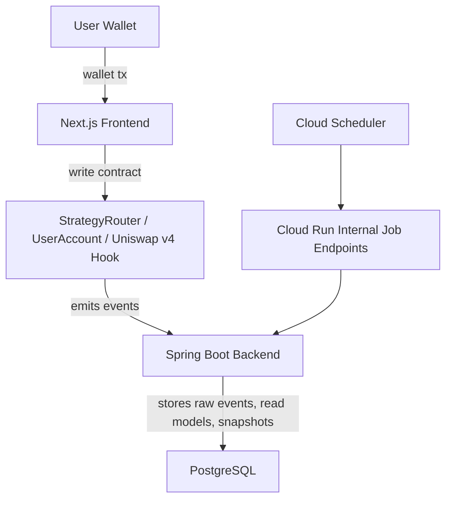

# Forkcast DeFi

**A one-button leveraged LP dApp on Aave V3 + Uniswap v4, with a Spring Boot backend that indexes on-chain events.**

Forkcast DeFi is a DeFi demo where users submit wallet transactions directly, while smart contracts execute the `supply -> borrow -> swap -> LP -> close` strategy flow.

The backend does not submit transactions on behalf of users. It indexes Router/Hook events that already happened on-chain and exposes position history and snapshots through query APIs.

Core principle:

> Keep asset execution authority in the user's wallet and smart contracts; use the backend to reliably record and query what already happened on-chain.


---

## 1. Project Overview

Forkcast DeFi connects Aave V3 and Uniswap v4 so a user can open and manage a leveraged LP position through a wallet-based transaction flow.

The first version was a contracts + frontend dApp. However, on-chain reads alone were not enough for position history and state tracking.  
So I added a Spring Boot backend that indexes Router/Hook events and exposes position timelines and snapshots.

This project has three main parts.

- `contracts/` - strategy contracts connecting Aave V3 and Uniswap v4
- `web/` - a Next.js dApp for wallet transactions and position views
- `backend/` - a Spring Boot indexer that stores on-chain events and serves history APIs

Each folder README explains the implementation details.

---

## 2. Monorepo Structure

```text
.
├─ contracts/   # Foundry smart contracts: StrategyRouter, UserAccount, Hook, Lens
├─ backend/     # Spring Boot indexer/query backend
├─ web/         # Next.js dApp frontend
└─ docs/        # API, backend design, ops, QA documents
```

---

## 3. Live Demo

- Live dApp: <https://forcast-web-2hdyy43b3q-du.a.run.app/>
- YouTube (v1 presentation before the backend was added): <https://youtu.be/3bI2R2cJe6c?si=HLHtmrSIzuoiiXxS>

To try the demo, you need Sepolia ETH and Aave Sepolia test tokens.

- Aave Sepolia Faucet: <https://gho.aave.com/faucet/>
- Sepolia ETH Faucet: <https://sepolia-faucet.pk910.de/>

---

## 4. High-Level Architecture



Users execute contract transactions from the frontend through their wallets.  
The contracts handle the Aave V3 and Uniswap v4 strategy flow, while the backend indexes emitted events and exposes history/snapshot APIs.

---

## 5. Entry Points by Role

### Backend / Blockchain Backend

The backend is an off-chain indexer/query backend.

- Spring Boot + Java 21, PostgreSQL, Flyway, web3j
- 4-layer data model: operational / raw event / read model / snapshot
- Lease-based `job_lock` with owner tokens for Cloud Run multi-instance safety
- `job_run` separated from business transactions so operational history survives failures
- Forward-only cursor + safe head (`latest - 5`) to control v1 reorg complexity
- Snapshot RPC collection separated from DB write transactions to reduce long-transaction risk

Read more:

- [backend/README.eng.md](backend/README.eng.md)
- [Data Model](docs/backend/data-model.md)

### Smart Contracts

The contracts connect Aave V3 and Uniswap v4 to execute a one-button leveraged LP strategy.

- `StrategyRouter`-centered open/close/collect flow
- Per-user `UserAccount` vault
- Aave supply/borrow/repay/withdraw integration
- Uniswap v4 LP creation, removal, and fee collection
- `SwapPriceLoggerHook` event logging
- `StrategyLens` view helper

Read more:

- [contracts/README.eng.md](contracts/README.eng.md)

### Frontend

The frontend handles wallet-based DeFi UX and backend history API integration.

- Next.js + TypeScript
- Wallet transactions through wagmi / viem
- Aave, Uniswap v4, and StrategyRouter state views
- Hook events, open positions, timelines, and snapshots enriched through backend APIs
- Existing wallet transaction flow preserved

Read more:

- [web/README.eng.md](web/README.eng.md)
- [Frontend Backend Integration Plan](docs/frontend/backend-integration-plan.md)

---

## 6. Tech Stack Summary

```text
Contracts: Solidity, Foundry, Aave V3, Uniswap v4
Backend:   Java 21, Spring Boot, Spring Data JPA, PostgreSQL, Flyway, web3j
Frontend:  Next.js, TypeScript, React, wagmi, viem, Zustand
Infra:     Cloud Run, Cloud SQL, Cloud Scheduler, Secret Manager
```

See each folder README for setup and environment variables.

---

## 7. Limitations and Intentional Simplifications

This is a technical prototype for learning and demonstrating DeFi/backend system design, not a production DeFi product.

- Sepolia testnet
- Custom test tokens and demo pool
- Pricing/PnL may differ from real market behavior
- Backend sync is not fully real-time
- v1 prefers safe-head sync over full reorg rebuild logic
- Advanced analytics, alerting, and admin dashboards are out of scope

---

## 8. Portfolio Focus

This project is intended to demonstrate:

- Understanding and integration experience with Aave V3 and Uniswap v4
- Clear responsibility separation between wallet-based transactions and backend indexing
- On-chain event indexing model design
- Spring Boot + PostgreSQL API server implementation
- Scheduled job, job lock, and cursor-based operations
- Frontend/backend API integration
- Cloud Run deployment and operations considerations
- Using AI agents as practical collaborators for backend review, QA, ops documentation, and iterative improvement

---

## 9. Future Work

- API cursor pagination
- Event replay/backfill
- More advanced reorg handling
- Snapshot-based PnL / return calculations
- Multi-pool / multi-chain support
- Alerting / reposition recommendation
- Admin dashboard for operations

---

## 10. Thanks

I learned a lot from Cyfrin and t4sk's DeFi/Uniswap v4 courses and materials.

- Cyfrin/UniswapV4 Contributor: <https://github.com/Cyfrin/defi-uniswap-v4>

