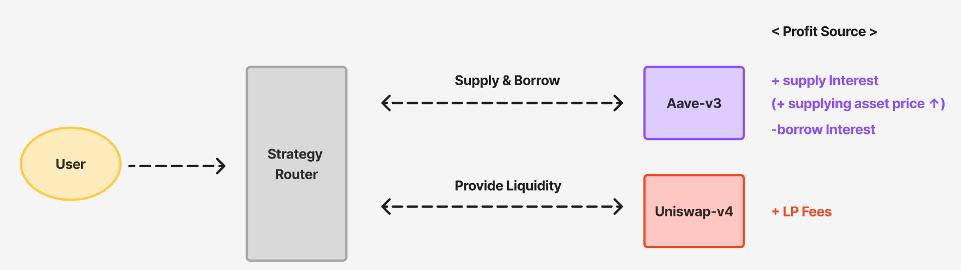
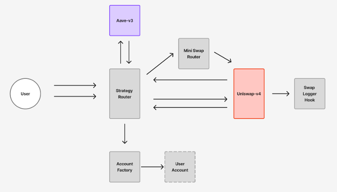
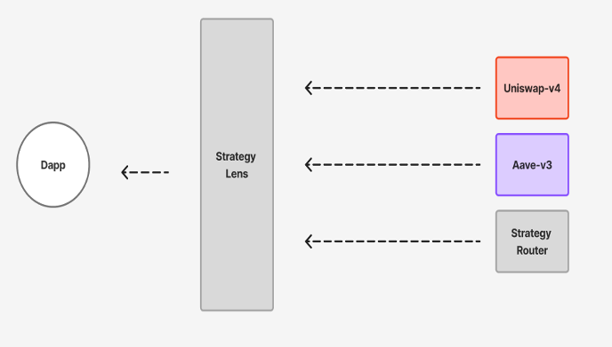

# Forkcast DeFi

🌐 Languages: [한국어 README](README.ko.md)

**Aave V3 + Uniswap v4 (Sepolia)** 위에서 동작하는 원버튼 레버리지 LP 전략 데모입니다.  
“supply → borrow → swap → LP → close” 흐름을 한 번에 실행하고, 중간 과정을 모두 확인할 수 있습니다.

---

## 1. Forkcast DeFi란?



Forkcast DeFi는 다음 플로우를 구현한 **원샷(One-shot) DeFi 전략 데모**입니다.

1. Aave V3에 ERC-20 자산을 담보로 예치한다.
2. 해당 담보를 기반으로 자산을 대출한다.
3. 빌린 자산의 일부를 스왑하고, Uniswap v4 풀에 유동성으로 공급한다.
4. 커스텀 Hook이 스왑 이벤트를 로깅해서, 전략이 어떻게 동작하는지 “눈으로” 확인할 수 있다.
5. 포지션을 정리할 땐: LP 제거 → 다시 스왑 → 대출 상환 → 담보 인출 순서로 마무리한다.

이 레포지토리는 **모노레포 구조**로 되어 있습니다.

- **contracts/** – Foundry 기반의 스마트 컨트랙트 (Aave V3 + Uniswap v4 전략)
- **web/** – Next.js 대시보드 & 데모 UI (wagmi/viem, Zustand, React Query)

---

## 2. Live Demo & 발표 영상 (한국어 자막 O) (먼저 시청해 주세요!)

- 🔗 **Live dApp**: <https://forkcast-web-799298411936.asia-northeast3.run.app/>
- 🎥 **YouTube**: <https://youtu.be/3bI2R2cJe6c?si=HLHtmrSIzuoiiXxS>

App을 사용하기 위해선 ETH와 Aave에서 만든 토큰들이 필요합니다.

- **Aave Sepolia Faucet** : <https://gho.aave.com/faucet/>
- **Sepolia ETH Faucet** : <https://sepolia-faucet.pk910.de/>

---

## 3. Monorepo 구조

```text
.
├─ contracts/   # Foundry smart contracts: Router, Vault, Lens, Hook, etc.
└─ web/         # Next.js app: dashboard, strategy UI, demo trader controls
```

Contracts 문서: [contracts/README.md](contracts/README.md)  
Web app 문서: [web/README.md](web/README.md)

---

## 4. High-Level Architecture



### StrategyRouter

`supply → borrow → swap → LP` 플로우와, 그 반대 방향의 `close` 플로우 전체를 오케스트레이션합니다.

### AccountFactory / UserAccount (vault)

유저별 금고(vault)를 생성하며, 각 금고는 aToken, 부채 포지션, Uniswap v4 LP NFT를 소유합니다.

### MiniV4SwapRouter

Uniswap v4 Universal Router를 쓰는 대신, **스왑 전용 v4 라우터**를 직접 구현해 사용합니다.

### StrategyLens



읽기 전용(view)으로 다음 정보를 제공합니다.

- Aave 리저브 & 유저 포지션 (HF, 담보, 부채)
- 전략 포지션 (tokenId, vault 주소, 틱 범위, 유동성)
- LP 수수료 & 포지션 요약

### Uniswap v4 Module + Hook

Uniswap v4 풀에 유동성을 예치/제거하고, 수수료를 수집하며,  
UI에서 사용할 수 있도록 스왑 이벤트를 로그로 남깁니다.

### Web (Next.js)

MetaMask와 연결하고 Router/Lens를 호출해 HF, 틱 범위, LP 유동성을 렌더링하며,  
Hook에서 발생한 이벤트 로그(**“Your swap”**)를 화면에 표시합니다.

---

## 5. Quick Start (Development)

### 5.1 Clone

```bash
git clone https://github.com/yourname/forkcast-defi.git
cd forkcast-defi
```

### 5.2 Contracts (Foundry)

```bash
cd contracts
cp .env.example .env    # fill in Sepolia RPC URL & Aave/Uniswap addresses
forge test
```

### 5.3 Web (Next.js)

```bash
cd ../web
cp .env.example .env    # paste deployed contract addresses from contracts
npm i
npm run dev
```

Then open http://localhost:3000
and follow along with the YouTube video.

---

## 6. Tech Stack

### App / Backend

- **Next.js** (App Router, API Routes)
  - Dashboard UI, modals
- **TypeScript + React**
- **wagmi + viem** (on-chain calls)
- **Zustand** (hook event / position state management)

### Smart Contracts

- **Foundry** (development, testing, deployment)
- **Solidity**

### Infra

- **Google Cloud Run**
- **RPC providers**: Infura / Alchemy (Sepolia)

---

## 7. Important Notes & Limitations

1. **비공식 토큰 & 풀**

   - Sepolia의 Aave 자산들은 커스텀 토큰이라, 데모를 위해 별도의 커스텀 풀을 만들었습니다.
   - 실제 유저들은 이 풀에서 거래하지 않으므로, 여기서의 PnL은 프로덕션 환경과 크게 다를 수 있습니다.

2. **단순화된 가격**

   - Aave 오라클 가격은 고정된 값처럼 취급하고, Uniswap v4 풀은 1:1 비율로 초기화했습니다.
   - 이 데모의 가격을 실제 시장 가격으로 해석하지 말아 주세요.

3. **항상 in-range인 유동성**

   - 데모에서 수수료가 잘 발생하도록, LP 포지션은 매우 넓은 틱 범위로 오픈됩니다.

4. **Tech-first 프로토타입**
   - 이 프로젝트의 목표는 기술 학습과 구현입니다.
   - 일부 설계 선택은 실제 DeFi 프로덕트에는 비현실적일 수 있습니다.

---

## 8. Technical & Personal Learnings

1. **내가 만든 아키텍처에 나도 헷갈릴 뻔했다**

   - 아키텍처가 점점 커지고 꼬이면서, 내가 설계한 시스템에서도 길을 잃을 수 있겠다고 느꼈습니다.
   - 그만큼 아직 더 개선해야 할 부분이 많다는 걸 다시 한 번 깨달았습니다.

2. **스펙과 커뮤니케이션이 생각보다 더 중요하다**

   - 실제 팀 프로젝트에서는 프론트엔드, 백엔드, 컨트랙트 사이에  
     명확한 문서와 공유된 인터페이스가 정말 중요하다는 걸 느꼈습니다.

3. **디파이 복습 & 블로깅으로 더 좋은 아이디어 찾기**
   - 이 정도 설계에서 막힌다는 건 아직 DeFi를 end-to-end로 완전히 이해하지 못했다는 의미라고 느꼈습니다.
   - 그래서 수학적 원리와 코드 디테일을 블로깅으로 다시 정리하고,  
     예전에 기여했던 Cyfrin DeFi 강의에도 더 깊게 기여하면서 이해도를 높이려 합니다.

---

## 9. Next Steps & Future Work

1. **전략 인지형(Strategy-aware) 자산 추천**

   - 리스크, 예상 수익률, 가격 시나리오를 기준으로  
     예치/대출에 사용할 자산을 추천합니다.
   - 예: 더 높은 HF vs 더 공격적인 레버리지 옵션 비교.

2. **오프체인 인덱서 & 백엔드 API**

   - 이 서비스와 관련된 이벤트를 구독하는 작은 인덱서를 만들고,  
     포지션 & PnL 히스토리를 DB에 저장합니다.
   - 이 역시 실제 시장 가격/수익률로 해석하지 말아 주세요.

3. **리포지셔닝 Hook & 알림**
   - Swap Logger Hook을 확장해서 포지션이 틱 범위 근처 또는 밖에 있는지 감지하고,
   - 프론트엔드 또는 백엔드 노티파이어로 **“reposition recommended”** 신호를 보냅니다.

---

## 10. Thanks to

최고의 디파이 강의를 제공해 주신 Cyfrin과 t4sk께 감사드립니다.
앞으로도 더 열심히 공부하고, 꾸준히 기여하는 컨트리뷰터가 되겠습니다.

- **Cyfrin/UniswapV4 Contributor**: <https://github.com/Cyfrin/defi-uniswap-v4>
