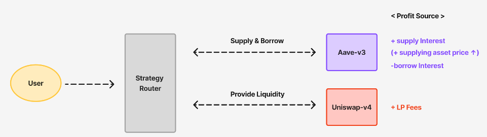
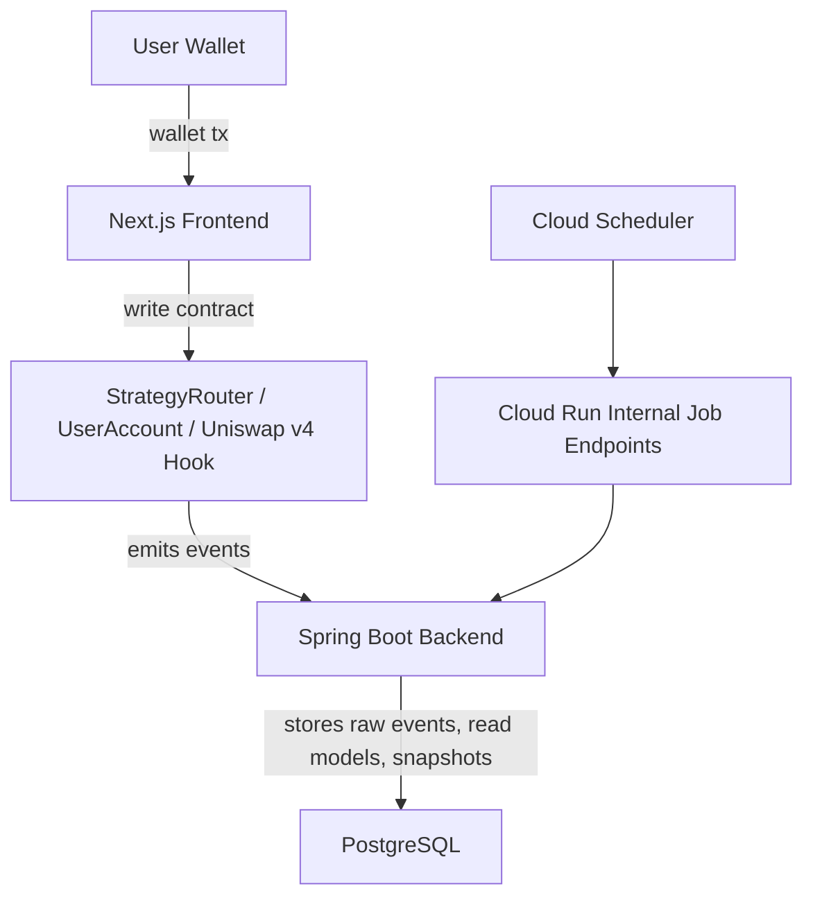

# Forkcast DeFi

**Aave V3 + Uniswap v4 기반 원버튼 레버리지 LP dApp과, 온체인 이벤트를 인덱싱하는 Spring Boot 백엔드 프로젝트입니다.**

Forkcast DeFi는 사용자가 지갑으로 직접 트랜잭션을 보내고, 스마트 컨트랙트가 `supply -> borrow -> swap -> LP -> close` 전략 흐름을 실행하는 DeFi 데모입니다.

백엔드는 사용자 대신 트랜잭션을 보내지 않습니다. 온체인에서 이미 발생한 Router/Hook 이벤트를 인덱싱하고, 포지션 히스토리와 스냅샷을 조회 가능한 API로 제공합니다.

핵심 방향:

> 사용자의 자산 실행 권한은 지갑과 컨트랙트에 남기고, 백엔드는 온체인에서 이미 일어난 일을 안정적으로 기록하고 조회 가능하게 만든다.



---

## 1. 프로젝트 개요

Forkcast DeFi는 Aave V3와 Uniswap v4를 연결해, 사용자가 한 번의 지갑 트랜잭션 흐름으로 레버리지 LP 포지션을 열고 관리할 수 있게 만든 DeFi 데모입니다.

처음에는 컨트랙트와 프론트엔드만 있는 dApp이었지만, 포지션 히스토리와 상태 추적은 온체인 read만으로 충분하지 않았습니다.  
그래서 Spring Boot 백엔드를 추가해 Router/Hook 이벤트를 인덱싱하고, 포지션 타임라인과 스냅샷을 조회할 수 있게 확장했습니다.

이 프로젝트는 세 부분으로 나뉩니다.

- `contracts/` — Aave V3와 Uniswap v4를 연결하는 전략 컨트랙트
- `web/` — 지갑 트랜잭션과 포지션 상태를 보여주는 Next.js dApp
- `backend/` — 온체인 이벤트를 저장하고 히스토리 API를 제공하는 Spring Boot 인덱서

자세한 구현 설명은 각 폴더 README에서 다룹니다.

---

## 2. Monorepo 구조

```text
.
├─ contracts/   # Foundry smart contracts: StrategyRouter, UserAccount, Hook, Lens
├─ backend/     # Spring Boot indexer/query backend
├─ web/         # Next.js dApp frontend
└─ docs/        # API, backend design, ops, QA documents
```

---

## 3. Live Demo

- Live dApp: <https://forcast-web-2hdyy43b3q-du.a.run.app/>
- YouTube (백엔드 추가 전 v1 발표 영상): <https://youtu.be/3bI2R2cJe6c?si=HLHtmrSIzuoiiXxS>

데모를 사용하려면 Sepolia ETH와 Aave Sepolia 테스트 토큰이 필요합니다.

- Aave Sepolia Faucet: <https://gho.aave.com/faucet/>
- Sepolia ETH Faucet: <https://sepolia-faucet.pk910.de/>

---

## 4. 전체 아키텍처



사용자는 프론트엔드에서 지갑으로 컨트랙트 트랜잭션을 실행합니다.  
컨트랙트는 Aave V3와 Uniswap v4 전략 흐름을 처리하고, 백엔드는 발생한 온체인 이벤트를 인덱싱해 히스토리와 스냅샷 API를 제공합니다.

---

## 5. 지원 분야별로 보기

### 백엔드 / 블록체인 백엔드

백엔드는 off-chain indexer/query backend입니다.

- Spring Boot + Java 21 · PostgreSQL · Flyway · web3j
- 4-layer 데이터 모델: operational / raw event / read model / snapshot
- lease 기반 `job_lock`과 owner token으로 Cloud Run multi-instance 중복 실행 방지
- `job_run`을 비즈니스 트랜잭션과 분리해 실패 상황에서도 운영 이력 보존
- forward-only cursor + safe head(`latest - 5`)로 v1 reorg 처리 복잡도 제어
- snapshot RPC 수집과 DB 저장 트랜잭션을 분리해 긴 트랜잭션 리스크 축소

자세히 보기:

- [backend/README.md](backend/README.ko.draft.md)
- [데이터 모델](docs/backend/data-model.md)

### 스마트 컨트랙트

컨트랙트는 Aave V3와 Uniswap v4를 연결해 원버튼 레버리지 LP 전략을 실행합니다.

- `StrategyRouter` 중심의 open/close/collect flow
- 사용자별 `UserAccount` vault
- Aave supply/borrow/repay/withdraw 연동
- Uniswap v4 LP 생성, 제거, 수수료 수집
- `SwapPriceLoggerHook` 기반 이벤트 로깅
- `StrategyLens` view helper

자세히 보기:

- [contracts/README.md](contracts/README.md)

### 프론트엔드

프론트엔드는 지갑 기반 DeFi UX와 백엔드 히스토리 API 연동을 담당합니다.

- Next.js + TypeScript
- wagmi / viem 기반 wallet transaction
- Aave, Uniswap v4, StrategyRouter 상태 표시
- backend API를 통한 hook event, open position, timeline, snapshot 보강
- 기존 wallet transaction flow 유지

자세히 보기:

- [web/README.ko.draft.md](web/README.ko.draft.md)
- [docs/frontend/backend-integration-plan.md](docs/frontend/backend-integration-plan.md)

---

## 6. Tech Stack 요약

```text
Contracts: Solidity, Foundry, Aave V3, Uniswap v4
Backend:   Java 21, Spring Boot, Spring Data JPA, PostgreSQL, Flyway, web3j
Frontend:  Next.js, TypeScript, React, wagmi, viem, Zustand
Infra:     Cloud Run, Cloud SQL, Cloud Scheduler, Secret Manager
```

상세 실행 방법과 환경 변수는 각 폴더 README를 확인합니다.

---

## 7. 한계와 의도적 단순화

이 프로젝트는 실제 운용 가능한 DeFi 상품이 아니라, DeFi와 백엔드 시스템 설계를 학습하고 보여주기 위한 technical prototype입니다.

- Sepolia 테스트넷 기준
- 커스텀 테스트 토큰과 데모 풀 사용
- 실제 시장 가격/PnL과 다를 수 있음
- 백엔드 sync는 완전 실시간이 아님
- v1은 full reorg rebuild보다 safe-head sync를 우선
- 복잡한 analytics, alerting, admin dashboard는 범위 밖

---

## 8. 포트폴리오 관점

이 프로젝트로 보여주고 싶은 역량은 다음입니다.

- DeFi 프로토콜 Aave V3와 Uniswap v4 이해와 통합 경험
- 지갑 기반 트랜잭션 흐름과 백엔드 책임 분리
- 온체인 이벤트 인덱싱 모델 설계
- Spring Boot + PostgreSQL 기반 API 서버 구현
- scheduled job, job lock, cursor 기반 운영 설계
- 프론트엔드와 백엔드 API 연동 설계
- Cloud Run 환경에서의 배포/운영 고려
- AI 에이전트와 협업해 백엔드 리뷰, QA, 운영 문서화처럼 역할이 다른 작업을 분리하고 빠르게 반복 개선

---

## 9. Future Work

- API cursor pagination
- event replay/backfill
- reorg 대응 정책 고도화
- snapshot 기반 PnL/수익률 계산
- multi-pool / multi-chain 지원
- alerting / reposition recommendation
- 운영용 admin dashboard

---

## 10. Thanks

Cyfrin과 t4sk의 DeFi/Uniswap v4 강의와 자료에서 많은 도움을 받았습니다.

- Cyfrin/UniswapV4 Contributor: <https://github.com/Cyfrin/defi-uniswap-v4>
