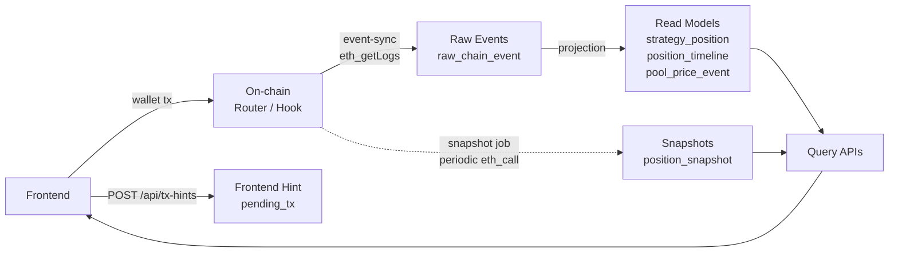

# Forkcast DeFi Backend

**Forkcast DeFi Backend is a Spring Boot service that indexes on-chain events and exposes position history and state snapshots through query APIs.**

This backend does not submit transactions on behalf of users.  
User actions happen through wallets and smart contracts; the backend observes chain events and stores them in the database.

---

## 1. Backend Role

The first version of Forkcast DeFi was a contracts + frontend dApp.

However, frontend-only and on-chain reads were not enough to reliably provide:

- historical position events
- all open positions
- timeline for a specific position
- Uniswap v4 hook price event history
- periodic position state snapshots
- reconciliation between pending frontend transactions and actual on-chain events
- retry-safe event sync
- scheduled job history and operational visibility

So the backend acts as an **off-chain indexer/query backend**.

---

## 2. What the Backend Does Not Do

This backend is not a centralized execution layer.

It does not:

- store user private keys
- sign wallet transactions for users
- open or close positions on behalf of users
- act as the final source of truth for on-chain state
- act as a simple RPC wrapper

The final truth is the on-chain event stream.  
The backend collects those events with acceptable delay and transforms them into query-friendly models.

---

## 3. Tech Stack

- **Application**: Java 21, Spring Boot, Spring Web MVC, Spring Data JPA
- **Data**: PostgreSQL, Flyway
- **Chain / Infra**: web3j, Google Cloud Run, Cloud Scheduler, Cloud SQL, Secret Manager

---

## 4. Problem Discovery and Improvements

The most important part of this backend was not just adding features, but making sure operational data survives when scheduled jobs fail or overlap.

Detailed retrospectives live under `docs/backend/`. This README keeps the key decisions short.

### R1. Hardening `job_lock`

The previous lock acquisition was part of a long job transaction, so the lock state might not have been committed before RPC work started.  
A nearly simultaneous second request could still see the old lock state and acquire the same job.

I separated lock acquisition into a `REQUIRES_NEW` transaction so the lock is committed first, and made acquisition atomic with a PostgreSQL `INSERT ... ON CONFLICT ... WHERE locked_until <= now()` statement.  
Each run now gets a UUID owner token, and release succeeds only when `locked_by` matches, so an old run cannot release a lock acquired by a newer run after lease expiry.

Details: [job_lock R1 note](../docs/backend/job-lock-r1-fix.md)

### R3. Separating `job_run` Operational History

`job_run` is an operational history table, but it was previously tied to the same transaction as the business work.  
If a job failed and the outer transaction rolled back, the failure record itself could disappear.

I moved `start`, `markSuccess`, `markFailed`, and `markSkipped` into `REQUIRES_NEW` transactions so operational history commits independently from business rollback.  
Separating only `markFailed` would not be enough, because it might not see an uncommitted `STARTED` row; the whole lifecycle needs its own transaction boundary.

Details: [job_run R3 rollback note](../docs/backend/job-run-r3-fix.md)

### R4. Slimming the `snapshot` Transaction

The previous snapshot job kept open-position reads, per-position `StrategyLens` RPC calls, and DB writes inside one long transaction.  
A single RPC failure could roll back snapshots that had already succeeded, while also holding DB resources for too long.

Now RPC results are collected outside the DB transaction, and only successful snapshots are written at the end through `SnapshotWriteService.saveAll()`.  
`SnapshotWriteService` is a separate bean so the Spring `@Transactional` proxy boundary is actually applied instead of being bypassed by self-invocation.

Details: [snapshot R4 transaction note](../docs/backend/snapshot-r4-fix.md)

### Event-sync Window Policy

Cloud Scheduler only triggers the job; the backend decides which block range to read.  
For v1, I compared reading up to `latestBlock`, using a rewind overlap window, and using forward-only sync with a safe head. The chosen policy is `safeHead = latestBlock - 5`.

This accepts one-cycle-later freshness in exchange for avoiding reorg rewind/rebuild complexity and keeping cursor semantics simple.  
Because this backend is an indexer/query backend, not a real-time transaction executor, stability and explainability were prioritized.

Details: [Event-sync Window Policy Discussion](../docs/discussions/event-sync-window-policy.md)

---

## 5. Package Structure

```text
backend/src/main/java/io/forkcast/backend
├─ chain/       # raw chain events and shared chain handling
├─ common/      # shared API/config
├─ job/         # job lock, job run, scheduler auth
├─ pool/        # pool price event queries
├─ position/    # open position and timeline read models
├─ snapshot/    # position snapshot job/API
├─ sync/        # event sync, cursor, RPC client, decoder
└─ txHint/      # frontend transaction hints
```

---

## 6. Data Model



The backend stores six logical groups of data.

This is an intentional separation of responsibilities, not just a table catalog.  
Events explain what happened. Snapshots explain what a position looked like at a point in time. Raw events remain replayable/debuggable, while read models are shaped for frontend queries.

### Operational tables

- `sync_cursor`
  - stores how far event-sync has processed
- `job_lock`
  - prevents duplicate execution of the same job
- `job_run`
  - stores job execution history, success/failure, and block ranges

### Frontend hint

- `pending_tx`
  - stores frontend hints after transaction submission
  - used for reconciliation, not final truth

### Raw event

- `raw_chain_event`
  - stores events read from chain logs
  - uses `(tx_hash, log_index)` as a duplicate-prevention constraint
  - kept for replay/debugging

### Read models

- `strategy_position`
  - current basic metadata for positions
- `position_timeline`
  - lifecycle events for a position
- `pool_price_event`
  - Hook-generated tick/sqrtPriceX96 events

### Snapshot

- `position_snapshot`
  - state at a specific point in time
  - liquidity, amount0/amount1, current tick, health factor, etc.

### User vault

- `user_vault`
  - relationship between user address and vault address

See [data-model.md](../docs/backend/data-model.md) for details.

---

## 7. Event Sync

The `event-sync` job reads Router and Hook events from chain logs and applies them to the DB.

Target events:

- `PositionOpened`
- `PositionClosed`
- `FeesCollected`
- `SwapPriceLogged`

Summary flow:

```text
1. Acquire job_lock and start job_run
2. Compute block range from sync_cursor
3. Fetch Router/Hook events with eth_getLogs
4. Store raw_chain_event and project read models
5. Update sync_cursor / job_run / job_lock
```

v1 uses a safe-head policy to avoid reading the newest blocks immediately.

```text
fromBlock = lastSyncedBlock + 1
toBlock = latestBlock - 5
```

This prioritizes simple and explainable operations over full reorg rebuild logic.  
The background is documented in [Event-sync Window Policy Discussion](../docs/discussions/event-sync-window-policy.md).

---

## 8. Snapshot Job

The `snapshot` job periodically stores state for currently open positions.

Summary flow:

```text
1. Acquire job_lock
2. Query open positions
3. Call StrategyLens RPC for each position
4. Collect successful snapshots in memory
5. Save position_snapshot rows with saveAll
6. Update job_run / job_lock
```

Snapshot is not the source of truth for position existence.  
Position existence comes from `strategy_position`, which is built by event-sync; snapshots enrich known positions with time-series state.

The long-transaction and partial-failure improvements are described in [snapshot R4 note](../docs/backend/snapshot-r4-fix.md).

---

## 9. Retry-safe Design

`event-sync` and `snapshot` may process the same range more than once.

The backend relies on unique constraints to prevent duplicate writes:

- `pending_tx.tx_hash`
- `raw_chain_event(tx_hash, log_index)`
- `pool_price_event(tx_hash, log_index)`
- `position_snapshot(token_id, snapshot_at)`
- `user_vault.vault_address`

For example, if the same `(tx_hash, log_index)` event is read again, the `raw_chain_event` unique constraint prevents duplicate insertion and the already-processed read model projection can be skipped.

This keeps retries, duplicate scheduler calls, and partial-failure recovery from easily duplicating data.

---

## 10. Scheduler / Job Lock

Production does not rely only on Spring `@Scheduled`.

Cloud Run can scale to zero and scale out to multiple instances. An in-process scheduler alone can fail to run or run the same job in multiple instances.

v1 uses:

```text
Cloud Scheduler -> Cloud Run internal endpoint -> Spring Boot job
```

Internal job endpoints:

```text
POST /internal/jobs/event-sync
POST /internal/jobs/snapshot
```

Each job uses `job_lock`.

- acquire lock before running
- return `202 SKIPPED` if the lock is already held
- use `locked_until` as a lease
- release immediately on normal completion
- recover automatically by lease expiry if the process dies

The acquisition/release hardening is documented in the [R1 job_lock note](../docs/backend/job-lock-r1-fix.md).

---

## 11. Scheduler Auth

Internal job endpoints must not be publicly callable in production.

v1 protection:

- Cloud Scheduler sends an OIDC ID token
- backend verifies the Google ID token
- backend checks the expected audience
- backend checks the allowed scheduler service account email

Local development can disable auth:

```text
SCHEDULER_AUTH_ENABLED=false
```

---

## 12. API

Public APIs:

| Method | Path                                      | Data source         | Notes                                               |
| ------ | ----------------------------------------- | ------------------- | --------------------------------------------------- |
| `GET`  | `/api/pools/{poolId}/price-events`        | `pool_price_event`  | tick + sqrtPriceX96                                 |
| `GET`  | `/api/users/{userAddress}/positions/open` | `strategy_position` | lower-case address normalization                    |
| `GET`  | `/api/positions/open`                     | `strategy_position` | all open positions                                  |
| `GET`  | `/api/positions/{tokenId}/timeline`       | `position_timeline` | metadata is a JSON string                           |
| `GET`  | `/api/positions/{tokenId}/snapshots`      | `position_snapshot` | bigint/decimal as string, healthFactor sentinel     |
| `POST` | `/api/tx-hints`                           | `pending_tx`        | best-effort hint, duplicate txHash prevention       |

Internal operational APIs:

| Method | Path                        | Job          | Notes                          |
| ------ | --------------------------- | ------------ | ------------------------------ |
| `POST` | `/internal/jobs/event-sync` | `event-sync` | returns `202 SKIPPED` if locked |
| `POST` | `/internal/jobs/snapshot`   | `snapshot`   | returns `202 SKIPPED` if locked |

See [api-spec.md](../api-spec.md) for response examples.

---

## 13. Local Development

PostgreSQL must be running locally.

Basic config:

```yaml
spring:
  datasource:
    url: jdbc:postgresql://localhost:5432/forkcast_defi
    username: forkcast_app
    password: <your_password>
```

Run tests:

```bash
./gradlew test
```

Run the server:

```bash
RPC_URL=<sepolia_rpc_url> \
STRATEGY_ROUTER_ADDRESS=<router_address> \
HOOK_ADDRESS=<hook_address> \
STRATEGY_LENS_ADDRESS=<lens_address> \
SCHEDULER_AUTH_ENABLED=false \
APP_CORS_ALLOWED_ORIGINS=http://localhost:3000 \
./gradlew bootRun
```

---

## 14. Ops Docs

- [Ops README](../docs/ops/README.md)
- [Scheduler Plan](../docs/backend/scheduler-plan.md)
- [Backend Decisions](../docs/backend/decisions.md)
- [Release Risk Review](../docs/backend/release-risk-review.md)

---

## 15. Future Work

- API cursor pagination
- Event replay/backfill command
- More advanced reorg handling
- Snapshot-based PnL calculation
- Alerting / reposition recommendation
- Admin dashboard
- Multi-pool / multi-chain expansion

