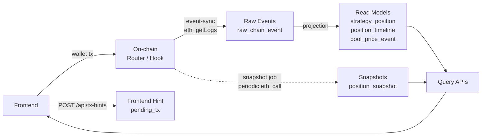

# Forkcast DeFi Backend

**Forkcast DeFi 백엔드는 온체인 이벤트를 인덱싱하고, 포지션 히스토리와 상태 스냅샷을 조회 API로 제공하는 Spring Boot 서버입니다.**

이 백엔드는 사용자 대신 트랜잭션을 보내지 않습니다.  
사용자 액션은 지갑과 스마트 컨트랙트에서 실행되고, 백엔드는 체인에서 발생한 이벤트를 관찰해 DB에 저장합니다.

---

## 1. 백엔드의 역할

Forkcast DeFi의 초기 버전은 컨트랙트와 프론트엔드 중심 dApp이었습니다.

하지만 프론트엔드와 온체인 read만으로는 다음 기능을 안정적으로 제공하기 어렵습니다.

- 과거 포지션 이벤트 조회
- 전체 오픈 포지션 조회
- 특정 포지션의 timeline 조회
- Uniswap v4 hook price event 히스토리 조회
- 주기적인 포지션 상태 snapshot 저장
- pending transaction과 실제 온체인 이벤트의 reconciliation
- retry-safe event sync
- scheduled job 실행 이력과 운영 상태 추적

그래서 백엔드는 **off-chain indexer/query backend** 역할을 합니다.

---

## 2. 백엔드가 하지 않는 일

이 백엔드는 중앙화된 실행 계층이 아닙니다.

하지 않는 일:

- 사용자 private key 보관
- 사용자 대신 wallet transaction 서명
- 사용자 대신 포지션 open/close 실행
- 온체인 상태의 최종 권위자 역할
- 단순 RPC wrapper 역할

최종 진실은 온체인 이벤트입니다.  
백엔드는 그 이벤트를 지연 허용 가능한 방식으로 수집하고, 조회하기 좋은 모델로 변환합니다.

---

## 3. 기술 스택

- **Application**: Java 21, Spring Boot, Spring Web MVC, Spring Data JPA
- **Data**: PostgreSQL, Flyway
- **Chain / Infra**: web3j, Google Cloud Run, Cloud Scheduler, Cloud SQL, Secret Manager

---

## 4. 문제 발견과 개선 기록

이 백엔드에서 가장 중요하게 다룬 부분은 "기능을 붙이는 것"보다, scheduled job이 실패하거나 겹칠 때 운영 데이터가 어떻게 안전하게 남는지였습니다.

자세한 회고 본문은 `docs/backend/`에 남겨두고, README에는 핵심 결정만 압축했습니다.

### R1. `job_lock` 안전화

기존 lock acquire는 긴 job 트랜잭션 안에 묶여 있어, RPC 작업이 시작되기 전에 lock 상태가 DB에 확정되지 않을 수 있었습니다.  
거의 동시에 들어온 두 번째 요청이 아직 예전 lock 상태를 보고 같은 job을 다시 잡을 수 있는 구조였습니다.

이를 `REQUIRES_NEW` 트랜잭션으로 분리해 lock acquire를 먼저 커밋하고, PostgreSQL `INSERT ... ON CONFLICT ... WHERE locked_until <= now()` 한 문장으로 원자화했습니다.  
또한 실행마다 UUID owner token을 발급하고 `locked_by`가 일치할 때만 release하도록 바꿔, lease 만료 후 새 실행이 잡은 lock을 이전 실행이 풀지 못하게 했습니다.

상세: [job_lock R1 수정 메모](../docs/backend/job-lock-r1-fix.md)

### R3. `job_run` 운영 이력 분리

`job_run`은 운영 이력 테이블인데, 기존에는 비즈니스 트랜잭션과 같이 묶여 있었습니다.  
그 결과 job이 실패하면서 바깥 트랜잭션이 rollback되면, 정작 남아야 할 실패 기록까지 같이 사라질 수 있었습니다.

`start`, `markSuccess`, `markFailed`, `markSkipped`를 모두 `REQUIRES_NEW`로 분리해 운영 이력이 비즈니스 롤백과 독립적으로 커밋되도록 바꿨습니다.  
특히 `markFailed`만 분리하면 미커밋 `STARTED` row를 못 볼 수 있으므로, lifecycle 전체를 별도 트랜잭션으로 분리했습니다.

상세: [job_run R3 실패 이력 롤백 문제 정리](../docs/backend/job-run-r3-fix.md)

### R4. `snapshot` 트랜잭션 슬림화

기존 snapshot job은 open position 조회, 포지션별 `StrategyLens` RPC, DB 저장이 하나의 긴 트랜잭션 안에 있었습니다.  
포지션 하나의 RPC 실패가 앞에서 성공한 snapshot 저장분까지 rollback시킬 수 있고, DB connection도 오래 점유하는 구조였습니다.

RPC 결과는 트랜잭션 밖에서 먼저 collect하고, 성공한 snapshot만 마지막에 `SnapshotWriteService.saveAll()`로 짧게 저장하도록 분리했습니다.  
별도 `SnapshotWriteService` 빈을 둔 이유는 같은 클래스 내부 호출로는 Spring `@Transactional` proxy 경계가 의도대로 적용되지 않을 수 있기 때문입니다.

상세: [snapshot R4 긴 트랜잭션 / 부분 실패 처리 개선 정리](../docs/backend/snapshot-r4-fix.md)

### Event-sync window policy

event-sync가 어느 block range를 읽을지는 Cloud Scheduler가 아니라 백엔드가 결정합니다.  
v1에서는 `latestBlock`까지 읽는 방식, rewind overlap 방식, forward-only + safe head 방식을 비교했고, `safeHead = latestBlock - 5` 정책을 선택했습니다.

이 선택은 최신 데이터 반영이 한 사이클 늦어질 수 있다는 tradeoff를 받아들이는 대신, v1에서 reorg rewind/rebuild 복잡도를 피하고 cursor semantics를 단순하게 유지합니다.  
백엔드는 실시간 transaction executor가 아니라 indexer/query backend이므로, 안정성과 설명 가능성을 우선했습니다.

상세: [Event-sync Window Policy Discussion](../docs/discussions/event-sync-window-policy.md)

---

## 5. 패키지 구조

```text
backend/src/main/java/io/forkcast/backend
├─ chain/       # raw chain event 저장, chain event 공통 처리
├─ common/      # 공통 API/config
├─ job/         # job lock, job run, scheduler auth
├─ pool/        # pool price event 조회
├─ position/    # open position, timeline read model
├─ snapshot/    # position snapshot job/API
├─ sync/        # event sync, cursor, RPC client, decoder
└─ txHint/      # frontend tx hint 저장
```

---

## 6. 데이터 모델



백엔드는 크게 여섯 종류의 데이터를 저장합니다.

이 분리는 단순한 테이블 카탈로그가 아니라 의도된 책임 분리입니다.  
events는 "무슨 일이 일어났는지"를 설명하고, snapshots는 "특정 시점에 어떤 상태였는지"를 설명합니다. raw event는 replay/debugging을 위해 보존하고, read model은 프론트 조회에 맞춘 형태로 따로 둡니다.

### Operational tables

- `sync_cursor`
  - event-sync가 어디까지 처리했는지 저장
- `job_lock`
  - 같은 job의 중복 실행 방지
- `job_run`
  - job 실행 이력, 성공/실패, block range 저장

### Frontend hint

- `pending_tx`
  - 프론트가 트랜잭션 제출 후 보낸 hint 저장
  - 최종 진실이 아니라 reconciliation 대상

### Raw event

- `raw_chain_event`
  - 체인에서 읽은 이벤트 원본 저장
  - `(tx_hash, log_index)` unique constraint로 중복 방지
  - replay/debugging 가능성을 남김

### Read models

- `strategy_position`
  - 현재 포지션의 기본 메타데이터
- `position_timeline`
  - 포지션 lifecycle 이벤트
- `pool_price_event`
  - Hook에서 발생한 tick/sqrtPriceX96 이벤트

### Snapshot

- `position_snapshot`
  - 특정 시점의 포지션 상태 저장
  - liquidity, amount0/amount1, current tick, health factor 등

### User vault

- `user_vault`
  - user address와 vault address 관계 저장

자세한 설계는 [../docs/backend/data-model.md](../docs/backend/data-model.md)를 확인합니다.

---

## 7. Event Sync

`event-sync` job은 Router와 Hook 이벤트를 체인 로그에서 읽어 DB에 반영합니다.

대상 이벤트:

- `PositionOpened`
- `PositionClosed`
- `FeesCollected`
- `SwapPriceLogged`

요약 흐름:

```text
1. job_lock 획득 및 job_run 시작
2. sync_cursor 기준 block range 계산
3. eth_getLogs로 Router/Hook 이벤트 조회
4. raw_chain_event 저장 및 read model projection
5. sync_cursor / job_run / job_lock 정리
```

v1은 최신 블록 몇 개를 피하는 safe-head 전략을 사용합니다.

```text
fromBlock = lastSyncedBlock + 1
toBlock = latestBlock - 5
```

완전한 reorg rebuild보다 단순하고 설명 가능한 운영 정책을 우선했습니다.  
window 정책 결정의 자세한 배경은 [Event-sync Window Policy Discussion](../docs/discussions/event-sync-window-policy.md)에 정리했습니다.

---

## 8. Snapshot Job

`snapshot` job은 현재 open position의 상태를 주기적으로 저장합니다.

요약 흐름:

```text
1. job_lock 획득
2. open position 목록 조회
3. 각 position에 대해 StrategyLens RPC 호출
4. 성공한 snapshot을 메모리에 collect
5. position_snapshot saveAll
6. job_run / job_lock 정리
```

snapshot은 position 존재 여부의 source of truth가 아닙니다.  
포지션 존재 여부는 event-sync가 만든 `strategy_position`이 담당하고, snapshot은 특정 시점의 상태 히스토리를 보강합니다.

긴 트랜잭션 제거와 부분 실패 처리 개선은 [snapshot R4 정리](../docs/backend/snapshot-r4-fix.md)에 따로 정리했습니다.

---

## 9. Retry-safe 설계

event-sync와 snapshot은 같은 범위를 다시 처리할 수 있습니다.

이를 위해 DB unique constraint를 중복 방지 장치로 사용합니다.

주요 unique constraint:

- `pending_tx.tx_hash`
- `raw_chain_event(tx_hash, log_index)`
- `pool_price_event(tx_hash, log_index)`
- `position_snapshot(token_id, snapshot_at)`
- `user_vault.vault_address`

예를 들어 같은 `(tx_hash, log_index)` 이벤트가 다시 들어와도 `raw_chain_event` unique constraint가 중복 insert를 막고, 이미 처리된 이벤트의 read model projection을 건너뛸 수 있습니다.

이 구조 덕분에 job retry, 중복 호출, 일부 실패 후 재시도 상황에서도 데이터가 쉽게 중복되지 않습니다.

---

## 10. Scheduler / Job Lock

Production에서는 Spring `@Scheduled`만으로 job을 실행하지 않습니다.

Cloud Run은 scale-to-zero와 scale-out 특성이 있으므로, in-process scheduler만 사용하면 다음 문제가 생길 수 있습니다.

- instance가 꺼져 있으면 job이 실행되지 않음
- 여러 instance에서 같은 job이 동시에 실행될 수 있음

그래서 v1은 다음 구조를 사용합니다.

```text
Cloud Scheduler -> Cloud Run internal endpoint -> Spring Boot job
```

내부 job endpoint:

```text
POST /internal/jobs/event-sync
POST /internal/jobs/snapshot
```

각 job은 `job_lock`을 사용합니다.

- lock을 얻으면 실행
- 이미 실행 중이면 `202 SKIPPED`
- lock은 `locked_until` 기반 lease 방식
- 정상 종료 시 즉시 release
- 프로세스가 죽으면 lease 만료 후 복구

lock acquire와 release의 세부 hardening은 [R1 job_lock 회고](../docs/backend/job-lock-r1-fix.md)에 정리했습니다.

---

## 11. Scheduler Auth

운영 환경에서 내부 job endpoint는 공개 호출되면 안 됩니다.

v1 보호 방식:

- Cloud Scheduler가 OIDC ID token 포함 요청
- 백엔드는 Google ID token 검증
- expected audience 검증
- 허용된 scheduler service account email 검증

로컬 개발에서는 다음 설정으로 auth를 끌 수 있습니다.

```text
SCHEDULER_AUTH_ENABLED=false
```

---

## 12. API

외부 조회/API:

| Method | Path                                      | 데이터 출처         | 비고                                                |
| ------ | ----------------------------------------- | ------------------- | --------------------------------------------------- |
| `GET`  | `/api/pools/{poolId}/price-events`        | `pool_price_event`  | tick + sqrtPriceX96                                 |
| `GET`  | `/api/users/{userAddress}/positions/open` | `strategy_position` | 주소 lower-case 정규화                              |
| `GET`  | `/api/positions/open`                     | `strategy_position` | 전체 오픈 포지션                                    |
| `GET`  | `/api/positions/{tokenId}/timeline`       | `position_timeline` | metadata는 JSON string                              |
| `GET`  | `/api/positions/{tokenId}/snapshots`      | `position_snapshot` | bigint/decimal은 string, healthFactor sentinel 처리 |
| `POST` | `/api/tx-hints`                           | `pending_tx`        | best-effort hint, 중복 txHash 방지                  |

내부 운영 API:

| Method | Path                        | Job          | 비고                           |
| ------ | --------------------------- | ------------ | ------------------------------ |
| `POST` | `/internal/jobs/event-sync` | `event-sync` | lock 보유 중이면 `202 SKIPPED` |
| `POST` | `/internal/jobs/snapshot`   | `snapshot`   | lock 보유 중이면 `202 SKIPPED` |

상세 응답 예시는 [../api-spec.md](../api-spec.md)를 확인합니다.

---

## 13. Local Development

PostgreSQL이 로컬에서 실행 중이어야 합니다.

기본 설정:

```yaml
spring:
  datasource:
    url: jdbc:postgresql://localhost:5432/forkcast_defi
    username: forkcast_app
    password: <your_password>
```

테스트:

```bash
./gradlew test
```

서버 실행:

```bash
RPC_URL=<sepolia_rpc_url> \
STRATEGY_ROUTER_ADDRESS=<router_address> \
HOOK_ADDRESS=<hook_address> \
STRATEGY_LENS_ADDRESS=<lens_address> \
SCHEDULER_AUTH_ENABLED=false \
APP_CORS_ALLOWED_ORIGINS=http://localhost:3000 \
./gradlew bootRun
```

---

## 14. 운영 문서

- [../docs/ops/README.md](../docs/ops/README.md)
- [../docs/backend/scheduler-plan.md](../docs/backend/scheduler-plan.md)
- [../docs/backend/decisions.md](../docs/backend/decisions.md)
- [../docs/backend/release-risk-review.md](../docs/backend/release-risk-review.md)

---

## 15. Future Work

- API cursor pagination
- event replay/backfill command
- reorg 대응 정책 고도화
- snapshot 기반 PnL 계산
- alerting / reposition recommendation
- admin dashboard
- multi-pool / multi-chain 확장
