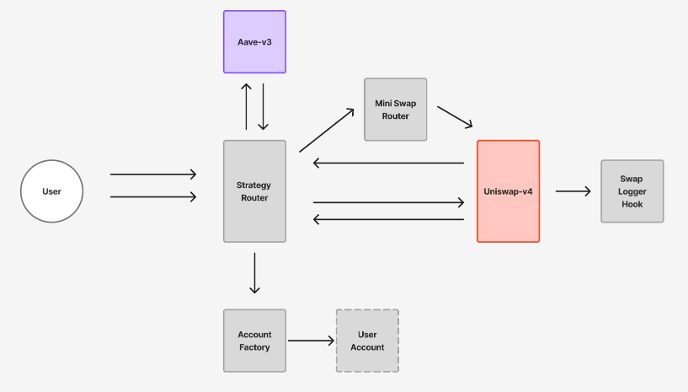
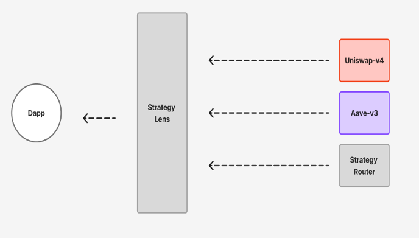

# Forkcast DeFi Contracts

**Forkcast DeFi의 스마트 컨트랙트는 Aave V3와 Uniswap v4를 연결해 원버튼 레버리지 LP 전략을 실행합니다.**

사용자는 프론트엔드에서 지갑으로 트랜잭션을 보내고, 컨트랙트는 다음 흐름을 처리합니다.

```text
supply -> borrow -> swap -> LP
close -> remove LP -> swap back -> repay -> withdraw
```

컨트랙트는 실제 자산 이동과 DeFi protocol interaction을 담당하고, 백엔드는 이 컨트랙트들이 발생시킨 이벤트를 나중에 인덱싱합니다.

---

## 1. 목표

이 패키지의 목표는 Aave V3와 Uniswap v4를 하나의 전략 흐름으로 묶는 것입니다.

사용자는 한 번의 액션으로:

1. Aave V3에 담보를 예치하고
2. 담보 기반으로 자산을 대출하고
3. 대출 자산 일부를 스왑하고
4. Uniswap v4 풀에 LP 포지션을 만들 수 있습니다.

포지션을 닫을 때는 반대 방향으로:

1. LP를 제거하고
2. 필요한 만큼 다시 스왑하고
3. Aave debt를 상환하고
4. 남은 담보를 인출합니다.

---

## 2. 주요 컨트랙트



### StrategyRouter

사용자의 메인 진입점입니다.

주요 기능:

- `openPosition`
- `closePosition`
- `collectFees`
- `previewClosePosition`

역할:

- 사용자 ERC-20을 받아 vault로 이동
- Aave supply/borrow 흐름 오케스트레이션
- Uniswap v4 swap/LP 흐름 오케스트레이션
- LP fee collect
- 포지션 close 흐름 실행

`StrategyRouter`는 전체 전략의 coordinator입니다.

### UserAccount

사용자별 vault 컨트랙트입니다.

역할:

- Aave collateral 보유
- Aave debt position 보유
- Uniswap v4 LP NFT 보유
- owner와 StrategyRouter만 주요 액션 수행 가능

사용자의 자산은 EOA에서 바로 복잡한 protocol interaction을 수행하는 대신, 사용자별 vault를 통해 관리됩니다.

### AccountFactory

사용자별 `UserAccount` vault를 생성하고 조회합니다.

역할:

- user -> vault 매핑 관리
- 필요할 때 lazy creation
- 프론트엔드와 백엔드가 vault address를 조회할 수 있게 함

### AaveModule

Aave V3 interaction을 담당하는 모듈입니다.

주요 기능:

- supply
- borrow
- repay
- withdraw

`StrategyRouter`의 복잡도를 줄이기 위해 Aave 관련 로직을 분리했습니다.

### UniswapV4Module

Uniswap v4 LP 관련 로직을 담당합니다.

주요 기능:

- LP position 생성
- LP 제거
- fee collect
- close flow에서 필요한 v4 interaction

### MiniV4SwapRouter

프로젝트에 필요한 최소 기능만 구현한 Uniswap v4 swap router입니다.

공식 Universal Router 전체 기능을 가져오는 대신, 이 프로젝트에서 필요한 swap flow에 집중했습니다.

역할:

- exact-input style swap
- 전략 컨트랙트와 테스트 helper에서 사용
- demo trader flow에서도 사용 가능

### SwapPriceLoggerHook

Uniswap v4 `AFTER_SWAP` hook입니다.

역할:

- swap 이후 pool price 정보를 이벤트로 기록
- `tick`
- `sqrtPriceX96`
- timestamp
- pool id 관련 정보

프론트엔드는 이 이벤트를 보여줄 수 있고, 백엔드는 이 이벤트를 인덱싱해 `pool_price_event` read model로 저장합니다.

### StrategyLens



프론트엔드와 백엔드를 위한 read-only view helper입니다.

역할:

- Aave reserve/user position 조회
- health factor, collateral, debt 조회
- strategy position view 구성
- Uniswap v4 LP position overview 제공
- snapshot job에서 현재 포지션 상태 조회

---

## 3. 핵심 흐름

### Open Position

```text
User
  -> StrategyRouter.openPosition
  -> AccountFactory.getOrCreate(user)
  -> UserAccount supplies collateral to Aave
  -> UserAccount borrows asset from Aave
  -> StrategyRouter swaps through MiniV4SwapRouter
  -> StrategyRouter adds liquidity to Uniswap v4
  -> LP NFT is owned by UserAccount
```

컨트랙트는 이벤트를 발생시키고, 백엔드는 이후 event-sync job에서 이를 읽습니다.

### Collect Fees

```text
User
  -> StrategyRouter.collectFees(tokenId)
  -> verify vault owns LP tokenId
  -> collect fees from Uniswap v4
  -> transfer collected token0/token1 to user
```

수수료 수집은 LP liquidity를 변경하지 않습니다.

### Close Position

```text
User
  -> StrategyRouter.closePosition
  -> remove Uniswap v4 liquidity
  -> swap withdrawn assets back to debt asset if needed
  -> repay Aave debt
  -> withdraw remaining collateral
  -> mark position closed
```

close flow는 open flow의 반대 방향입니다.

---

## 4. 백엔드와의 연결 지점

컨트랙트와 백엔드는 직접 실행 권한을 공유하지 않습니다.

백엔드는 다음 이벤트를 읽어 DB에 저장합니다.

- `PositionOpened`
- `PositionClosed`
- `FeesCollected`
- `SwapPriceLogged`

이 이벤트들은 백엔드에서 다음 read model로 변환됩니다.

- `strategy_position`
- `position_timeline`
- `pool_price_event`
- `position_snapshot`

중요한 점:

- 컨트랙트가 실행의 source입니다.
- 백엔드는 실행 결과를 관찰합니다.
- 사용자는 계속 지갑으로 트랜잭션을 보냅니다.
- 백엔드는 private key를 보관하지 않습니다.

---

## 5. 디자인 결정

### Per-user vault를 둔 이유

사용자별 `UserAccount` vault가 Aave collateral, debt position, Uniswap v4 LP NFT를 소유합니다.

공유 vault 하나에 모든 사용자의 포지션을 섞는 방식보다, 사용자별 소유 경계와 권한 검증이 명확합니다.  
백엔드와 프론트엔드도 user -> vault -> tokenId 관계를 기준으로 포지션을 추적할 수 있습니다.

### MiniV4SwapRouter를 직접 둔 이유

공식 Universal Router는 범용성이 높지만, 이 프로젝트에는 필요 이상의 기능과 복잡도를 가져옵니다.

`MiniV4SwapRouter`는 현재 전략에 필요한 exact-input style swap과 테스트/데모 흐름에 집중합니다.  
덕분에 전략 컨트랙트가 어떤 v4 interaction을 수행하는지 읽기 쉽고, 테스트 범위도 좁게 잡을 수 있습니다.

### AFTER_SWAP hook만 사용한 이유

`SwapPriceLoggerHook`은 swap 이후 가격 정보를 이벤트로 남기는 관찰용 hook입니다.

Hook이 pool state를 복잡하게 변경하거나 전략 실행 책임을 갖지 않도록 제한해, hook의 역할을 observability에 가깝게 유지했습니다.

### HookMiner를 사용한 이유

Uniswap v4 hook은 주소에 hook permission flag가 encoded되어야 합니다.

`HookMiner`를 사용해 원하는 flag 조합을 만족하는 CREATE2 주소를 찾고, `AFTER_SWAP` hook으로 동작할 수 있는 주소에 배포합니다.

---

## 6. 폴더 구조

```text
contracts
├─ src/
│  ├─ accounts/       # UserAccount vault
│  ├─ factory/        # AccountFactory
│  ├─ hook/           # SwapPriceLoggerHook, HookFactory
│  ├─ interfaces/     # Aave / Uniswap / ERC20 interfaces
│  ├─ lens/           # StrategyLens
│  ├─ libs/           # helper libraries
│  ├─ router/         # StrategyRouter, AaveModule, UniswapV4Module
│  ├─ types/          # shared structs/types
│  ├─ uniswapV4/      # MiniV4SwapRouter
│  └─ utils/          # utility contracts
├─ script/            # deployment / initialization scripts
└─ test/              # Foundry tests
```

---

## 7. 테스트 관점

테스트는 다음 성격을 포함합니다.

- Uniswap v4 pool init / add liquidity / remove liquidity
- swap 동작과 revert case
- hook event emission
- openPosition happy path
- closePosition happy path
- collectFees happy path
- not owner / already closed / insufficient balance 등 edge case
- previewClosePosition sanity check

일부 테스트는 Sepolia fork 기반으로 Aave/Uniswap v4 실 배포 주소와 상호작용합니다.  
즉, 단순 mock만 검증하는 것이 아니라 실제 프로토콜 주소를 기준으로 happy path와 revert case를 함께 확인합니다.

---

## 8. Local Development

요구 사항:

- Foundry
- Sepolia RPC URL
- Aave V3 Sepolia 주소
- Uniswap v4 Sepolia 주소
- 테스트용 ERC-20 토큰

실행:

```bash
cd contracts
cp .env.example .env
forge test
```

환경 변수 예시:

```text
SEPOLIA_RPC_URL=<your_rpc_url>
AAVE_POOL_ADDRESSES_PROVIDER=<address>
AAVE_PROTOCOL_DATA_PROVIDER=<address>
POOL_MANAGER=<address>
POSITION_MANAGER=<address>
PERMIT2=<address>
AAVE_UNDERLYING_SEPOLIA=<address>
LINK_UNDERLYING_SEPOLIA=<address>
WBTC_UNDERLYING_SEPOLIA=<address>
USER_ADDRESS=<test_user_address>
```

---

## 9. 설계상 한계

이 컨트랙트 패키지는 production DeFi product가 아니라 technical prototype입니다.

의도적 단순화:

- Sepolia 기준
- 테스트 토큰과 커스텀 풀 사용
- 단일 전략 flow 중심
- 단일 pool 설정 중심
- LP tick range는 데모 친화적으로 넓게 설정
- pricing/PnL은 실제 시장 환경과 다를 수 있음
- upgradeability/proxy 패턴 없음

---

## 10. 관련 문서

- [../readme-draft.ko.md](../readme-draft.ko.md)
- [README.md](README.md)
- [src/README.md](src/README.md)
- [../backend/README.ko.draft.md](../backend/README.ko.draft.md)
- [../api-spec.md](../api-spec.md)
